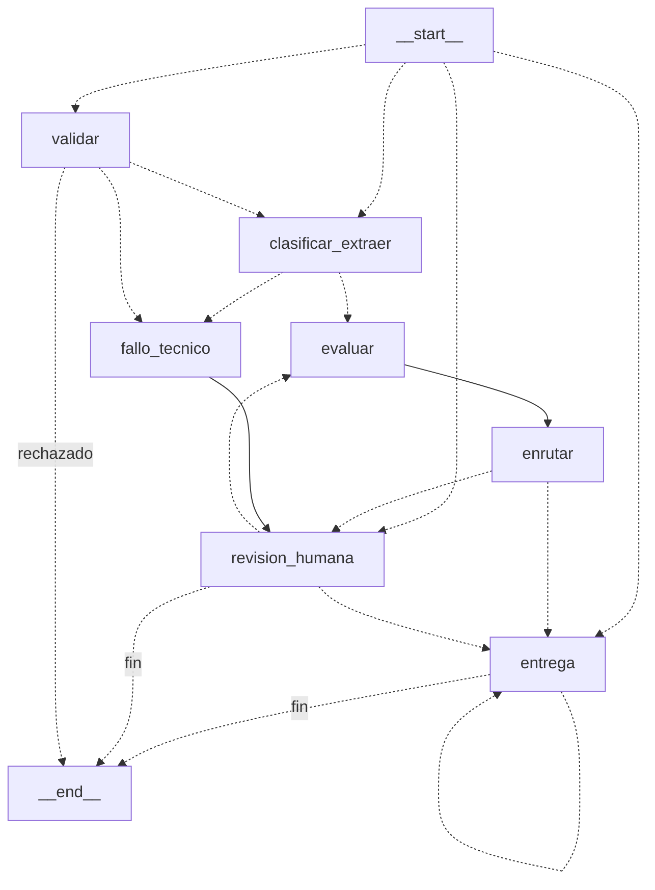

# MediFlow — Agente Autónomo de Triaje Clínico

> **Hackathon ONE G10 · Proyecto 2 · Alura / Oracle Next Education**
> Agente autónomo para triaje, extracción estructurada y enrutamiento inteligente de documentos
> clínicos, con foco cardiorrespiratorio y soporte para países hispanohablantes de Latinoamérica.

MediFlow resuelve el cuello de botella de las urgencias hospitalarias: la acumulación de documentos
clínicos sin clasificar. El sistema clasifica el documento, extrae datos médicos bajo estándares
internacionales (**HL7 FHIR**, **CIE-10**, **CIE-11**, **NEWS2**) y dispara alertas críticas en menos de
60 minutos ante hallazgos de riesgo vital, preservando la privacidad del paciente mediante
seudonimización previa.

---

## 1. Arquitectura

```text
G10-Equipo20-MediFlow/
├── backend/                    API FastAPI + grafo LangGraph
│   ├── app/
│   │   ├── api/                53 endpoints REST (documentos, revision, alertas,
│   │   │                       farmacia, autorizaciones, metricas, administracion...)
│   │   ├── core/               Configuración, base de datos, sesiones, arranque
│   │   ├── graph/              Grafo determinista LangGraph + memoria con checkpoints
│   │   ├── models/             Modelos SQLAlchemy (documento, alerta, paciente, gobierno)
│   │   ├── packs/              Paquete de reglas por pais (fechas, identidad, numeros)
│   │   ├── repositories/       Capa de persistencia
│   │   ├── schemas/            Contratos Pydantic v2 (request, resultado, propuesta)
│   │   └── services/           Orquestador, LLM, hallazgos, NEWS2, seudonimizacion,
│   │                           enrutamiento, compuerta de calidad, alertas, storage
│   ├── config/
│   │   ├── packs/co.yaml       Reglas de Colombia (hallazgos, umbrales, coberturas)
│   │   └── prompts/triaje_v1.md  Prompt medico versionado
│   ├── migrations/             Alembic
│   ├── scripts/                Carga masiva, compuerta de calidad, purga, escalamiento
│   └── tests/                  707 tests
│
├── frontend/                   React 19 + TypeScript + Vite
│   ├── src/pages/              13 pantallas (documentos, revision, alertas, farmacia,
│   │                           autorizaciones, entregas, pacientes, configuracion...)
│   ├── src/app/                Router, sesion, roles, motor de pared clinica
│   ├── src/components/         Shell, modales, tags, avisos
│   └── src/types.ts            Tipado estricto del pipeline
│
└── samples/                    6 casos de prueba + 11 archivos de ejemplo
```

---

## 2. Diagrama del flujo de decisión del agente

El agente es un **grafo determinista de LangGraph**. Entra por la etapa en que se encuentra el
documento y las aristas son condicionales. Este bloque se genera desde el grafo compilado: un test
(`test_grafo_contrato.py`) falla si el README deja de coincidir con el código.

<!-- grafo:inicio -->

<!-- grafo:fin -->

### Los 7 nodos

| Nodo | Qué hace |
|---|---|
| `validar` | Valida formato, tamaño y contenido. Si no cumple, `RECHAZADO`; si falla técnico, `FALLO_TECNICO` |
| `clasificar_extraer` | El LLM multimodal clasifica el documento y extrae las entidades clínicas en JSON estricto |
| `evaluar` | Detección determinista de hallazgos críticos, score NEWS2 y cálculo de confianza |
| `enrutar` | Decide el destino según prioridad y cobertura |
| `fallo_tecnico` | Captura errores del LLM; ya deja alerta si había hallazgo crítico |
| `revision_humana` | Human-in-the-Loop. Interrumpe y espera la decisión de una persona |
| `entrega` | Confirma la entrega. Se interrumpe por cada acuse, verificación o confirmación |

### Ciclo de vida del documento

```text
RECIBIDO → VALIDADO → CLASIFICADO → EXTRAIDO → EVALUADO → ENRUTADO → ENTREGADO
                ↓                       ↓            ↓
            RECHAZADO              FALLO_TECNICO   EN_REVISION_HUMANA → RESUELTO
```

En `revision_humana` el grafo se **interrumpe** y reanuda con la decisión de la persona: rechazar
cierra, aprobar pasa a entrega, y corregir o transcribir vuelven a `evaluar` sin volver a llamar al
LLM. En `entrega` se interrumpe por cada confirmación hasta que no queda nada pendiente: un hallazgo
crítico nunca queda sin acuse.

---

## 3. Stack tecnológico

| Capa | Tecnología |
|---|---|
| **Lenguaje backend** | Python 3.12 |
| **API** | FastAPI + Uvicorn, contratos Pydantic v2 |
| **Orquestación del agente** | LangGraph (grafo con checkpoints) |
| **Base de datos** | PostgreSQL (producción) · SQLite (desarrollo local) |
| **Migraciones** | Alembic |
| **LLM** | OpenAI `gpt-4.1-mini` o Google Gemini `gemini-2.5-flash` (intercambiable) |
| **Frontend** | React 19 · TypeScript · Vite |
| **Estándares clínicos** | HL7 FHIR, CIE-10, CIE-11, NEWS2 |
| **Almacenamiento** | Cloudflare R2 (S3) · OCI Object Storage · carpeta local |
| **Despliegue** | Docker + Docker Compose |
| **Tests** | pytest (backend) · Vitest (frontend) |

---

## 4. Cómo ejecutar

Guía completa para Windows: **[INSTRUCCIONES-WINDOWS.md](INSTRUCCIONES-WINDOWS.md)**

### Resumen

```bash
# 1. Backend
cd backend
python -m pip install -r requirements.txt
cp .env.example .env          # en Windows: copy .env.example .env
uvicorn app.main:app --reload --port 8000

# 2. Frontend (en otra terminal)
cd frontend
npm install
npm run dev
```

- Aplicación: <http://localhost:5173>
- API (Swagger): <http://localhost:8000/docs>

### Variables de entorno relevantes

```ini
# Base de datos (SQLite en local, PostgreSQL en producción)
DATABASE_URL=sqlite:///./mediflow.db

# LLM: openai | gemini
LLM_PROVEEDOR=openai
OPENAI_API_KEY=
GEMINI_API_KEY=

# Almacenamiento: r2 | oci | (vacio = carpeta local)
STORAGE_BACKEND=
R2_BUCKET_NAME=
OCI_NAMESPACE=
OCI_BUCKET=
```

> **Nunca se versionan las credenciales.** `.env` está en `.gitignore`; solo se comparte `.env.example`.

---

## 5. Casos de prueba del hackathon

Los tres escenarios exigidos por el enunciado están implementados y cubiertos por tests:

| Caso | Escenario | Archivo de muestra | Test |
|---|---|---|---|
| 1 | **Flujo estándar aprobado** | `samples/caso02_formula_losartan.txt` | `test_caso_02_formula_de_losartan_completa` |
| 2 | **Prioridad de urgencia médica** | `samples/caso01_tc_torax_tep.txt` | `test_caso_01_tc_torax_con_TEP_sin_identificador` |
| 3 | **Ambiguo → auditoría humana** | `samples/caso04_orden_eco_estres_sin_justificacion.txt` | `test_caso_04_orden_ambulatoria_sin_justificacion` |

Caso 2 en detalle: un informe de angioTC con tromboembolismo pulmonar agudo se clasifica como
`Informe de Estudio por Imágenes`, prioridad `Urgente`, extrae el CIE-10 `I26.9` y enruta a
`Cola_Emergencia_Médica` generando la alerta al canal de guardia.

### Otros escenarios cubiertos

Los 26 casos de aceptación (`backend/tests/test_aceptacion.py`) incluyen además:

- Falso negativo del LLM contrastado contra el código CIE (caso 9)
- Código diagnóstico en CIE-11 sin CIE-10 (caso 10)
- Seudonimización: solo viajan tokens al LLM (caso 13)
- Decimales con coma y con punto (casos 14, 15)
- Validación de cédula correcta y alterada (casos 16, 17)
- Recetas de alto riesgo sin recetario oficial (caso 22)
- Órdenes sin cobertura y con excepción especial (casos 24, 25)

Se pueden cargar desde la pantalla **Documentos → Cargar un caso de ejemplo**.

---

## 6. Motor clínico

### Seudonimización previa

Antes de enviar cualquier texto al LLM, el pipeline reemplaza la identidad del paciente por un token
estable (`[PAC-8492-CL]`). El modelo nunca ve nombre, cédula ni documento real. El hash es
reversible solo dentro de la instalación.

### Detección determinista + LLM

La capa crítica **no depende del LLM**. Un escaneo determinista de hallazgos críticos y del score
NEWS2 corre siempre; el LLM solo aporta la extracción estructurada. Si el LLM dice "rutina" pero el
código extraído es un IAM, la regla determinista gana (caso 9).

### Paquete de reglas por país

`backend/config/packs/co.yaml` define, sin tocar código:

- Hallazgos críticos con sinónimos, CIE-10 y CIE-11
- Umbrales de NEWS2 y escalas ajustadas (incluye EPOC)
- Catálogos de cobertura y programas de coverage
- Tipos de documento admitidos
- Retención y reglas de purga

---

## 7. Roles

| Rol | Ve | Puede |
|---|---|---|
| **Administrador del sistema** | Usuarios, accesos, pack de país | Gestionar cuentas. No ve datos clínicos |
| **Auditor clínico** | Todo el flujo | Aprobar, corregir, bajar prioridad con justificación |
| **Jefe de urgencias** | Documentos, alertas | Acusar alertas, resolver incidencias |
| **Químico farmacético** | Farmacia, recetas | Verificar recetas y autorizaciones |
| **Auditor de autorizaciones** | Autorizaciones | Resolver autorizaciones de cobertura |
| **Gestor de la clínica** | Configuración, métricas | Configurar reglas de triaje sin tocar código |

La matriz de permisos vive en la tabla de roles y llega al frontend por `GET /auth/roles`: la interfaz
arma el menú desde el backend, no desde constantes sueltas.

---

## 8. Seguridad y privacidad

| Medida | Detalle |
|---|---|
| Sesión obligatoria | Ninguna sección clínica responde sin sesión válida |
| Cookie | `HttpOnly`, `SameSite=Lax`, token hasheado con PBKDF2 |
| RBAC | Cada sección depende del rol; el administrador no ve datos clínicos |
| Seudonimización | La identidad se reemplaza antes de salir del servidor |
| Auditoría | Cada acceso a un documento registra quién, cuándo y qué vio |
| Sin credenciales en el repo | `.env` ignorado; solo `.env.example` se versiona |
| Límites de uso | Cuota de llamadas al LLM por periodo y de documentos por minuto |

---

## 9. Pruebas

```bash
cd backend && python -m pytest        # 707 tests
cd frontend && npm test               # 142 tests
```

El backend corre **849 tests** en total entre ambas suites, incluyendo 26 casos de aceptación de
extremo a extremo y un test de contrato que verifica que el diagrama de este README sigue
coincidiendo con el grafo compilado.

---

## 10. Estructura del resultado

Cada documento produce un JSON estructurado con clasificación, datos extraídos, decisión de
enrutamiento y evidencia de persistencia:

```json
{
  "status": "procesado",
  "documento_id": "DOC-CLIN-2026-8942",
  "clasificacion": {
    "tipo_documento": "Informe de Estudio por Imagenes",
    "especialidad": "Radiologia / Neumonologia",
    "nivel_prioridad": "Urgente",
    "score_confianza_clasificacion": 0.99
  },
  "datos_extraidos": {
    "paciente": { "nombre": "[PAC-8492-CL]", "edad": 52 },
    "medico_solicitante": { "nombre": "Dra. Renata Silveira", "matricula": "145892" },
    "diagnostico_principal": "Tromboembolismo Pulmonar Agudo (TEP)",
    "cie10_sugerido": "I26.9"
  },
  "decision_enrutamiento": {
    "destino_principal": "Cola_Emergencia_Medica",
    "requiere_auditoria_humana": false,
    "notificacion_generada": {
      "canal": "Alerta_Guardia_Medica",
      "mensaje": "ALERTA URGENTE: Informe critico de TEP Agudo"
    }
  }
}
```

---

## Equipo 20 — Hackathon ONE G10

Wilmer Acosta · Aldo Espinoza · Bryan Segovia · Cesar Barrera · Angel Audelo ·
Geyson Morales · Giselle Morales · Ivan Montes · Jackeline Puruaya · Marx Vilam
